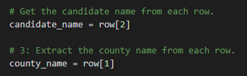

# Election_Analysis

## Project Overview
A Colorado Board of Elections emplotee has given you the following tasks to complete the election audit of a recent local congressional election.

1. Calculate the total number of votes cast.
2. Get a complete list of candidates who received votes.
3. Calculate the total number of votes each candidate received.
4. Calculate the percentage of votes each candidate won.
5. Determine the winner of the election based on popular vote.

## Resources
- Data Source: election_results.csv
- Software: Python 3.9.1, Visual Studio Code 1.54.1

## Summary
The analysis of the election shows that:
- There were 369,711 votes cast in the election.
- The candidates were:
    - Charles Casper Stockham
    - Diana DeGette
    - Raymon Anthony Doane
- The candidate results were:
    - Charles Casper Stockham received 23.0% of the vote and 85,213 votes.
    - Diana DeGette received 73.8% of the vote and 272,892 votes.
    - Raymon Anthony Doane received 3.1% of the vote and 11,606 votes.
- The winner of the election was:
    - Diana DeGette, who received 73.8% of the vote and 272,892 votes.

## Challenge Overview
The election commission has requested some additional data to complete the audit:

1. The voter turnout for each county
2. The percentage of votes from each county out of the total count
3. The county with the highest turnout

## Challenge Summary
The analysis of the election shows that:
- The county turnouts were:
    - Jeffersion received 38,855 votes.
    - Denver received 306,055 votes.
    - Arapahoe received 24,801 votes.
- The county percentages were:
    - Jeffersion received 10.5% of the total vote.
    - Denver received 82.8% of the total vote.
    - Arapahoe received 6.7% of the total vote.
- The county with the highest turnout was:
    - Denver, who received 82.8% of the total vote with 306,055 votes.

### Additional Script Uses
This script can be used for any election, currently we only use the two columns, County and Candidate. If you had additional columns you wanted to get similar data on you could revise the candidate_name and/or county_name variables to look at different columns by changing the number in the square brackets of the below code. For example changing 'row[2]' to 'row[3]' would get the code to look at whatever data you'd added to the fourth column of your csv:



Or you may have noticed the percentages don't exactly add up to 100% as they're only rounding to one decimal place. You can get even more exact numbers by changing all the cases of formatting code where it says '.1f' to instead be '.2f'. I've included an example of one such place below:
```
        candidate_results = (
            f"{candidate_name}: {vote_percentage:.1f}% ({votes:,})\n")
```
